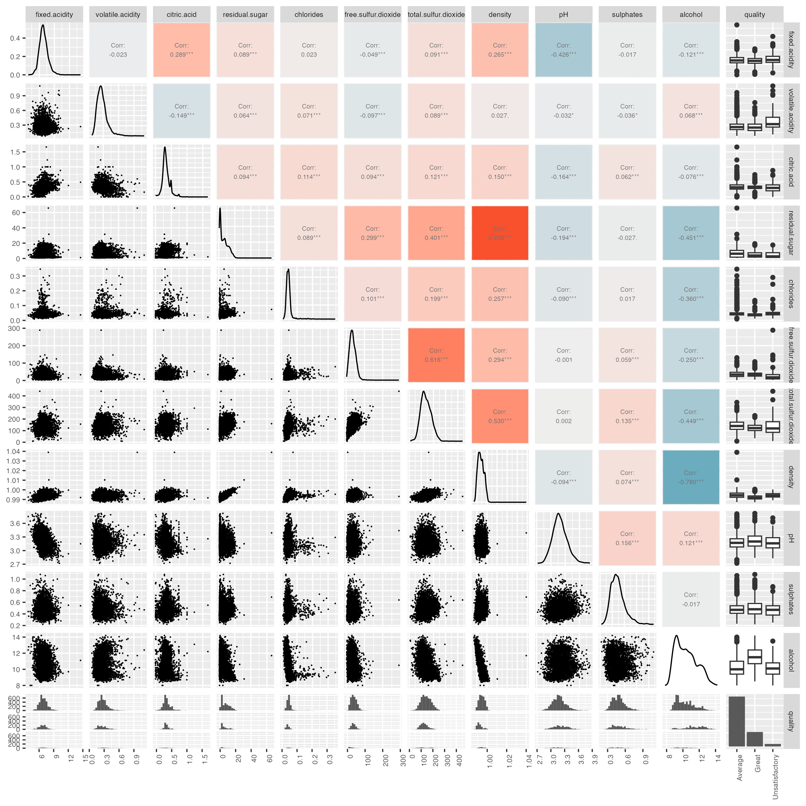

```{r, echo=FALSE, message=FALSE}
library(tidyverse)
library(repr)
library(tidymodels)
library(kknn)
library(wineclassify)

library("ggplot2")                     
library("GGally")
```

# Introduction

In this project, we attempt to build a classification model using the
k-nearest neighbor algorithm to classify and predict white wine. This
model can help the wine rating association or connoisseur understand the
relationship between each variable such as acidity, density and etc.
Therefore, they are able to determine the quality of wine more
accurately or less objectively. While the average wine enjoyer wouldn't
know much about wine other than it is made from grapes and fermented.
Therefore our group decided to dig deeper into the production of wine
and how each factor contributes to its quality. In this project we would
like to see which factors plays the most significant role in terms of
wine quality and how significant they are. By using k-nearest neighbor
we are able to group each variables to test each of their correlation
with the quality itself. We will also be using cross validation to
confirm our prediction results with our training data to verify the
authenticity of our model. We hope that this project is able to help you
get a better insight our your "average" wine that you are drinking.

The question that the project wants to answer is How does each factor
affect the overall wine quality? The dataset that we will be using for
answering this question is the 12 characteristics of the Portuguese
"Vinho Verde" wine collected during Oct., 2009 from Wine Quality Data
Set [@wine_data_set]. This data consists of all chemical factors that
makes up a wine such as pH, alcohol percentage, density, sulfur dioxide
and etc.

# Method

We first load the required libraries like tidyverse [@tidyverse], knitr
[@knitr] used for classification of the data

## Reading in the white wine dataset from Jupyter

```{r,echo=FALSE, message=FALSE}
data <- data_load("https://raw.githubusercontent.com/kashish1928/dsci-310-group-02/main/data/raw_data.csv", ',')
knitr::kable(head(data), caption = "Data")
```

Key Observations :
- The dataset contains 4898 observations with 12 variables out of which, 11 input variables based on physicochemical tests which affect wine quality and 1 output variable which is the quality of the wine.
- The input varaibles are:- fixed acidity ($g / dm^3$), volatile acidity ($g / dm^3$), citric acid ($g / dm^3$), residual sugar ($g / dm^3$), chlorides ($g / dm^3$,sulfur dioxide ($mg / dm^3$), total sulfur dioxide ($mg / dm^3$), density ($g / cm^3$), pH, sulphates ($g / dm3$), alcohol (% by volume)
- Based on sensor data, the variable output is a quality score between 0 and 10. Each wine was evaluated by at least three wine experts, with 0 representing the lowest quality and 10 representing the highest quality.

## Cleaning the data

Data cleaning was performed as following steps:

1.  Changing the column names so they don't have spaces in between them
    <br>
2.  Labelling the white wine quality as categorical values and setting
    them as a factor for the dataset<br>
3.  Set each column as a double expect quality column

```{r, echo=FALSE, message=FALSE}
cleaned_data <- data_load("https://raw.githubusercontent.com/kashish1928/dsci-310-group-02/main/data/cleaned_data.csv",',')

knitr::kable(table(cleaned_data$quality), caption = "Data quality Distribution")

knitr::kable(head(cleaned_data), caption = "Cleaned Data")
```

# Analysis

## Summary of the Data

Let's study the summary statistics of each of the columns of our data.

This can help us find any otherwise hidden inconsistencies or trends in the data.


```{r, echo=FALSE, message=FALSE}
data_summary <- data_load("https://raw.githubusercontent.com/kashish1928/dsci-310-group-02/main/results/summary_data.csv",",")
knitr::kable(data_summary, caption = "Data Summary")
```

## Counting and graphing all the different quality of wines

Here we visualize the distribution of the wine and their quality
(average, great, unsatisfactory)

```{r count-plot, echo=FALSE, message=FALSE,fig.cap=" Total Count of White Wine Quality"}
knitr::include_graphics("../results/count_plot.png")
```

It seems that in general most of the wine is considered average, while
it is considered more great than it being unsatisfactory.

## Looking at the correlation between all predictors and the predicted

```{r ggpairs-plot, echo=FALSE, message=FALSE,fig.cap="Correlation plot of the predictor variables", warning=FALSE}
corr_plot_ <- corr_plot(cleaned_data)

```

From the ggpairs plot, we can find there is a strong positive correlation between density and residual sugar and a strong negative correlation between density and 
alcohol. But since the majority of the correlation between variables is not 
significant and the KNN classification we're about to perform is a non-parametric method, we'll keep these variables in the following model-creating procedures.

## Splitting a training and testing data set and creating a recipe for it

Now we split the data into training and testing,data splitting is
typically done to avoid overfitting.

Our training data:

```{r, echo=FALSE, message=FALSE}
#training
training_data <- data_load('https://raw.githubusercontent.com/kashish1928/dsci-310-group-02/main/data/training_data.csv',',')

# testing data
testing <- data_load('https://raw.githubusercontent.com/kashish1928/dsci-310-group-02/main/data/test_data.csv',',')

knitr::kable(head(training_data), caption = "Training data Table")
```

We will now generate a recipe in order to center and scale the data, we
do this so that a predictor does not have a higher effect over the other
just because of their high values.

## Making a 10-fold cross validation for wine quality training data set

We use cross-folding (K-folds cross validation) because it ensures that
every observation from the original dataset has the chance of appearing
in training and test set.

In the case of making a 10-fold cross validation for wine quality training data set, the dataset would be divided into 10 folds, with 9 folds used for training and 1 fold used for testing each time. This process is repeated 10 times, so that each fold is used exactly once for testing.

We can ensure that the model is not simply "memorizing" the training data without actually learning to generalize to new examples and obtain a more accurate estimate of the model's performance on new, unseen data by employing this method.

## Setting up the workflow for the recipe and knn fold

We use a workflow because it can help to ensure that the data is
properly preprocessed, the model is trained and evaluated using the same
parameters and metrics.
By following a well-defined workflow, we can ensure that the data is properly preprocessed, the model is trained and evaluated using the same parameters and metrics, and that the results are reproducible and interpretable.

## Graphing the accuracy and the KNN

We can also visualize the K-value selection process in the form of a
line graph with accuracy on the y-axis vs. the k-value on the x-axis (see Figure \@ref(fig:k-plot)).
Note that accuracy is at its maximum when k = 1 (given the high
randomness of this data set, this value will vary greatly if the random
seed is changed compared to a real-world data set).

```{r k-plot, echo=FALSE, message=FALSE,fig.cap="The relationship between accuracy and the number of neighbors"}
knitr::include_graphics("../results/k_plot.png")
accurate_sd <- 0.00466
```

## Using the most accurate K value to then build our Classification Model

We will then generate a new K-nearest neighbors model using K = 1.
Using a K value of 1 means that the model will only consider the single nearest neighbor when making predictions. This can be beneficial in cases where the data is highly non-linear or there are complex decision boundaries, as the model will be able to capture fine-grained patterns and relationships in the data.

## Using the new classification model to build to predict the accuracy and shown through a Confusion Matrix {#sec:conf-mat}

Then, we can put the recipe generated earlier together with our new
model in the workflow() function and fit it to our training data set.
Our classification model is now trained and complete!

```{r, echo=FALSE, message=FALSE}
conf_mat <- readRDS('../results/final_model_quality.rds')
conf_mat
```

# Results

Data was split into 75% training and 25% testing sets. The relationship
between predictor variables(physicochemical variable) and response
variable listed in Figure \@ref(fig:count-plot) was visualized to evaluate the utility for
modelling. The result showed that there was no evidence of having strong
relationship between them was omitted from modeling. We first perform a
10-fold cross validation test. We then created a workflow based on the
cross validation and recipe that we made.

After using our KNN Classification, we figured out that our best
k-neighbour would be 1 as the result shown in Figure \@ref(fig:k-plot). Then
we use the best_k to predict our accuracy and present it through a
confusion matrix in Section \@ref(sec:conf-mat). We got that the estimate to be 1 exactly.
We also found that the standard error for our best k was very low:
`r accurate_sd`. This means that our prediction was very accurate when testing
our prediction data.

# Discussion

When we got the estimate of 1, which the number of best k-nearest neighbours 
that means that our data was exactly correlated and no error was made between the prediction when we are
training and testing the data. This was not what we had expected because
we thought more factors would be more contributing to the overall wine
quality. In addtion, we saw that there a clear imbalance in your dataset as there was a significant more amount of average than great or satisfactory
in terms of Wine categories. Thus our model was heavily leaning towards the average wine category instead of having a more balanced wine quality model.
Such findings can benefit the wine industry as it highlights
the most important factor for making a good wine. Thus able to boost
their own reputation and quality of wine and therefore attracting more
customers. Also such findings is able to group certain wines together
and provide more variations for the consumers. From this finding we can
ask ourselves: Is it similar for other beverages or food? Should we
consider more variables such as region and climate for each location of
wine produced? Some conclusions can we drawn from the estimate. Our
original data maybe under sampled or flawed so thus when we are
performing our classification we would get over repeated values and thus
having no error when training our data. On the other hand, when we
trained our data the seed of our data ran the exact operations needed to
have the perfect predict however this is extremely unlikely. Moreover,
since we are including all of the predictors that are used in this data
therefore creating such a high estimate for the prediction because the
more the predictors we use the higher the $R^2$ and adjusted $R^2$ we get
from the values.

# References
